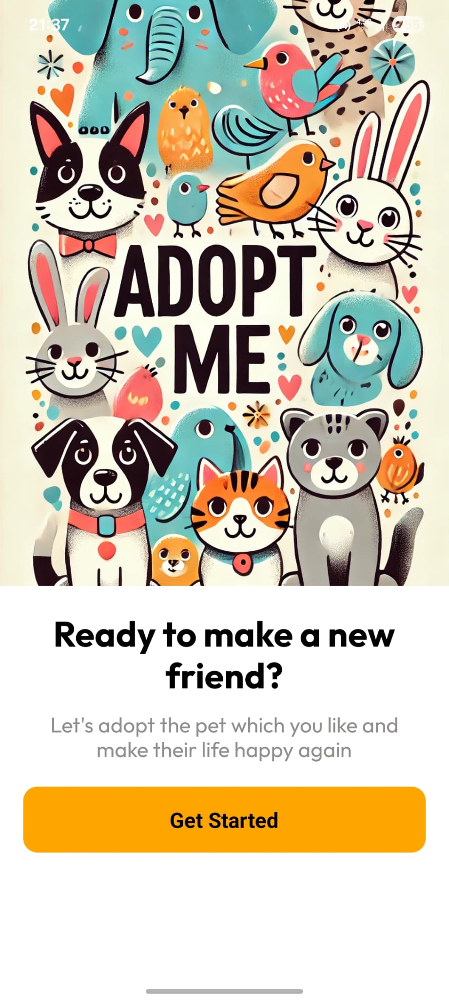
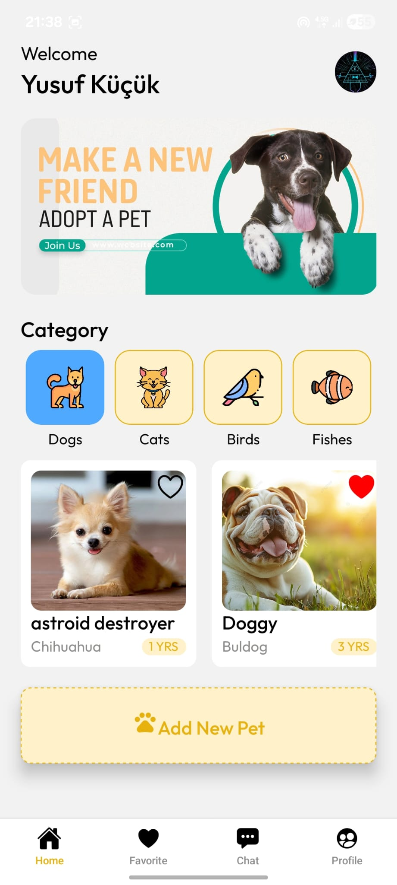
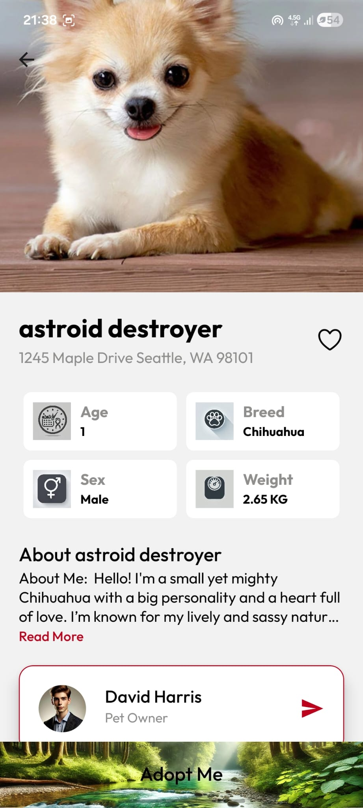
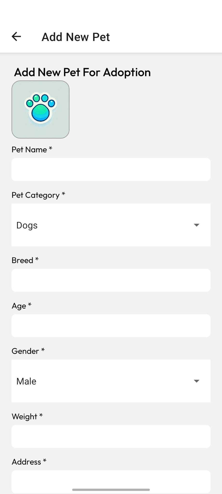
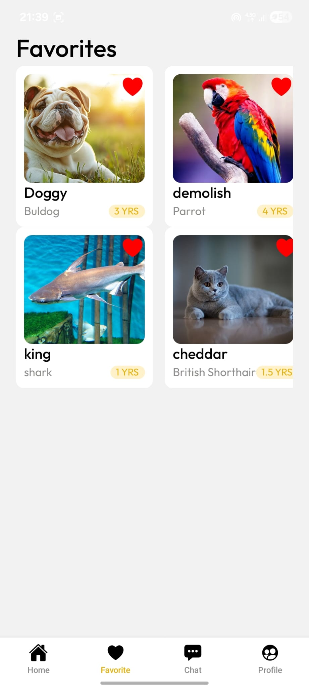
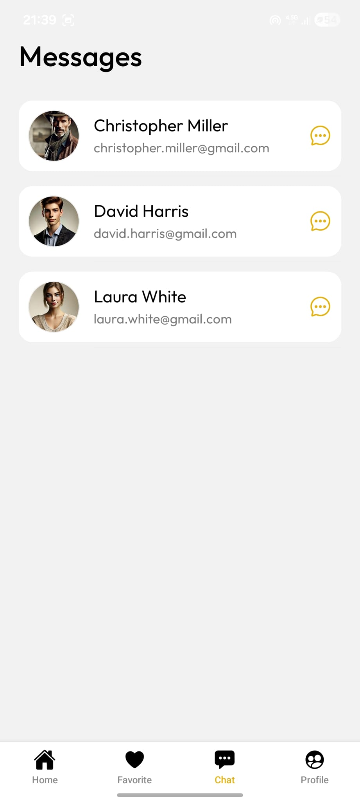
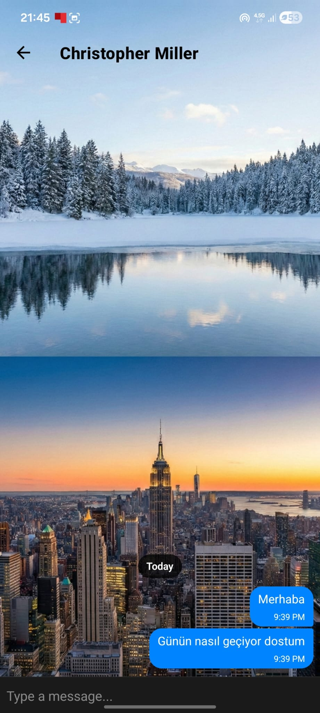
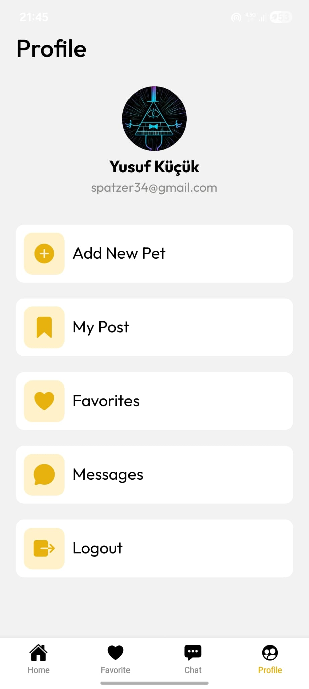
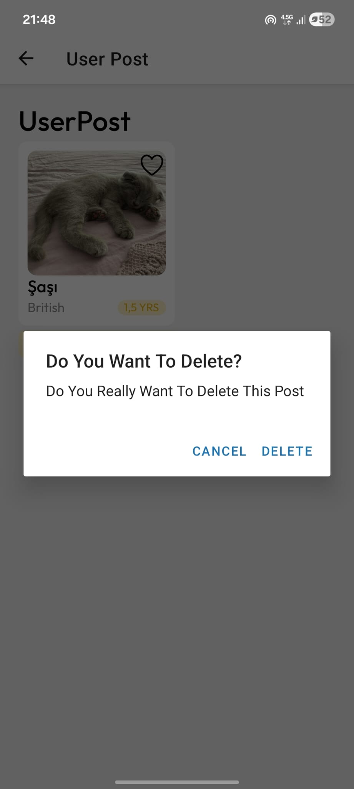

# 🐾 Pet Adoption App

A modern, user-friendly mobile application built to connect our furry friends with loving new homes. Users can browse pets awaiting adoption by category, add their favorite pets to a wishlist, and instantly communicate with pet owners via an in-app messaging system. Additionally, users can easily create and manage their own adoption listings.

## ✨ Key Features

* **Categorized Listings:** Easily filter pets by categories such as Dogs, Cats, Birds, and Fishes.
* **Detailed Pet Profiles:** View comprehensive information including age, breed, weight, gender, location, and a personalized "About" section for each pet.
* **Add New Pet Form:** Seamlessly create new adoption listings by uploading a photo and providing essential details.
* **Favorites System:** Like pets to save them to a dedicated "Favorites" screen for quick access later.
* **Real-Time Chat:** Secure, in-app real-time messaging between potential adopters and pet owners.
* **Profile & Post Management:** View user profiles, track personal listings ("My Post"), and securely delete own posts when necessary.

## 🚀 Tech Stack

* **Frontend:** React Native, Expo
* **Backend & Database:** Firebase (Authentication, Firestore Database, Storage)
* **Navigation:** Expo Router

## 📸 Screenshots













## 🛠️ Installation & Setup

To run this project locally, follow these steps:

1. Clone the repository:
   ```bash
   git clone [https://github.com/YOUR_USERNAME/YOUR_REPO_NAME.git](https://github.com/YOUR_USERNAME/YOUR_REPO_NAME.git)


# Welcome to your Expo app 👋

This is an [Expo](https://expo.dev) project created with [`create-expo-app`](https://www.npmjs.com/package/create-expo-app).

## Get started

1. Install dependencies

   ```bash
   npm install
   ```

2. Start the app

   ```bash
    npx expo start
   ```

In the output, you'll find options to open the app in a

- [development build](https://docs.expo.dev/develop/development-builds/introduction/)
- [Android emulator](https://docs.expo.dev/workflow/android-studio-emulator/)
- [iOS simulator](https://docs.expo.dev/workflow/ios-simulator/)
- [Expo Go](https://expo.dev/go), a limited sandbox for trying out app development with Expo

You can start developing by editing the files inside the **app** directory. This project uses [file-based routing](https://docs.expo.dev/router/introduction).

## Get a fresh project

When you're ready, run:

```bash
npm run reset-project
```

This command will move the starter code to the **app-example** directory and create a blank **app** directory where you can start developing.

## Learn more

To learn more about developing your project with Expo, look at the following resources:

- [Expo documentation](https://docs.expo.dev/): Learn fundamentals, or go into advanced topics with our [guides](https://docs.expo.dev/guides).
- [Learn Expo tutorial](https://docs.expo.dev/tutorial/introduction/): Follow a step-by-step tutorial where you'll create a project that runs on Android, iOS, and the web.

## Join the community

Join our community of developers creating universal apps.

- [Expo on GitHub](https://github.com/expo/expo): View our open source platform and contribute.
- [Discord community](https://chat.expo.dev): Chat with Expo users and ask questions.
